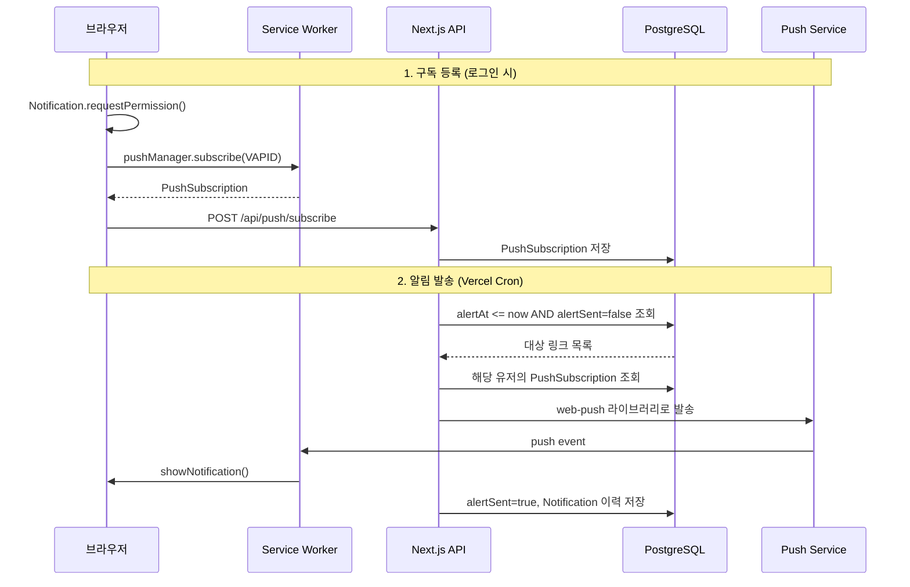
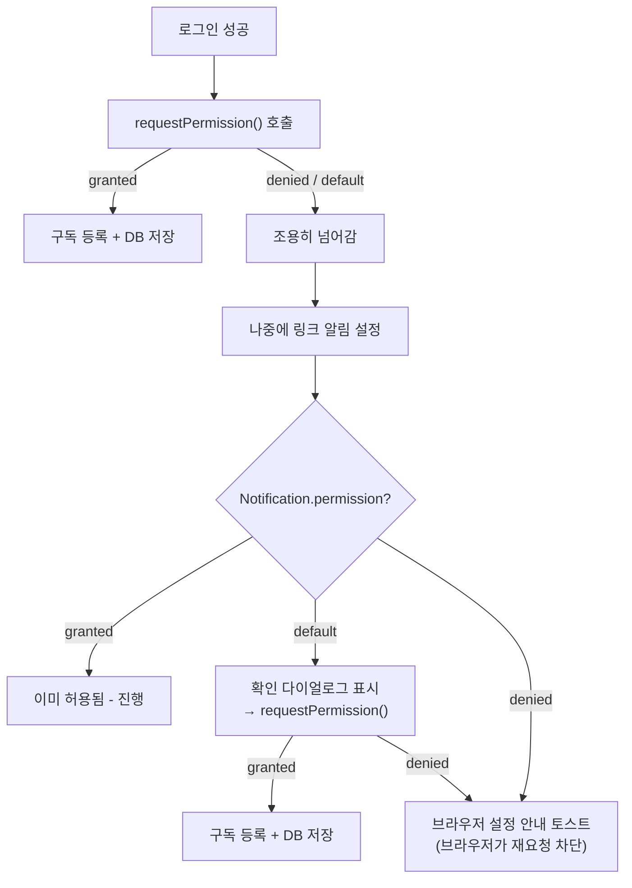

# Web Push 알림 구현 계획

## 전체 아키텍처



## 1. VAPID 키 생성 및 환경변수

`web-push` 라이브러리의 CLI로 VAPID 키 쌍을 생성하고, `.env`에 추가합니다.

```bash
npx web-push generate-vapid-keys
```

```
NEXT_PUBLIC_VAPID_PUBLIC_KEY=<generated_public_key>
VAPID_PRIVATE_KEY=<generated_private_key>
```

`NEXT_PUBLIC_` prefix로 공개키는 클라이언트에서, 비공개키는 서버에서만 사용합니다.

---

## 2. Prisma 스키마 변경

[prisma/schema.prisma](prisma/schema.prisma)에 2가지 변경:

**A. `PushSubscription` 모델 추가** — 브라우저 구독 정보 저장

```prisma
model PushSubscription {
  id        Int      @id @default(autoincrement())
  userId    String
  endpoint  String   @unique
  p256dh    String
  auth      String
  createdAt DateTime @default(now())
  user      User     @relation(fields: [userId], references: [id], onDelete: Cascade)

  @@index([userId])
}
```

**B. `Link` 모델에 알림 스케줄 필드 추가**

```prisma
model Link {
  // ...기존 필드
  alertAt   DateTime?
  alertSent Boolean   @default(false)
}
```

- `alertAt`: `alertType`과 `createdAt`으로 계산한 실제 알림 발송 시각
- `alertSent`: 발송 완료 여부 (중복 발송 방지)

`User` 모델에도 `pushSubscriptions PushSubscription[]` relation 추가.

---

## 3. Service Worker 생성

`public/sw.js` — Next.js의 `public/` 디렉토리에 두면 루트 경로(`/sw.js`)로 서빙됩니다.

핵심 로직:

- `push` 이벤트 수신 → `self.registration.showNotification()` 호출
- `notificationclick` 이벤트 → 해당 링크 URL로 이동
- payload에 `{ title, body, url, icon }` 포함

---

## 4. 클라이언트 — 구독 등록 (2단계 권한 요청)

권한 요청을 2번의 기회로 나누어 처리합니다:

- **1차**: 로그인 직후 → 거부해도 OK
- **2차**: 알림을 설정(alertType != NONE)하려 할 때 → 권한이 없으면 다시 요청



### 4-1. 푸시 구독 유틸리티

`src/shared/utils/pushSubscription.ts` 생성. 주요 함수 3개:

- `**subscribeToPush(userId)**`: `requestPermission()` → SW 등록 → `pushManager.subscribe(VAPID)` → 서버 API로 구독 저장. 이미 `granted`면 조용히 구독만 갱신.
- `**getPushPermissionStatus()**`: 현재 `Notification.permission` 상태 반환 (`granted` / `denied` / `default`).
- `**ensurePushPermission(userId)**`: 알림 설정 시 호출하는 함수.
  - `granted` → 이미 OK, `true` 반환
  - `default` → `requestPermission()` 재호출 → 결과에 따라 구독 등록
  - `denied` → 브라우저가 재요청을 차단하므로 `false` 반환 (호출부에서 안내 토스트 표시)

### 4-2. 로그인 후 자동 실행 (1차 요청)

[src/app/auth/callback/page.tsx](src/app/auth/callback/page.tsx)에서 로그인 성공 후 `subscribeToPush(userId)` 호출. 거부해도 에러 없이 넘어감.

### 4-3. 알림 설정 시 재확인 (2차 요청)

[src/features/form-link/ui/LinkFormUI.tsx](src/features/form-link/ui/LinkFormUI.tsx)의 **step 2**에서 `alert` 값이 `NONE`이 아닌 값으로 변경될 때:

1. `getPushPermissionStatus()` 체크
2. `'default'`인 경우 → 확인 다이얼로그("알림을 받으려면 브라우저 알림을 허용해야 합니다. 허용하시겠습니까?") 표시 → 확인 시 `ensurePushPermission(userId)` 호출
3. `'denied'`인 경우 → `toast.info("브라우저 설정에서 알림을 허용해주세요.")` 안내 (브라우저가 `denied` 상태에서는 `requestPermission()`을 호출해도 다이얼로그가 뜨지 않음)
4. `'granted'`인 경우 → 아무 동작 없이 진행

현재 `LabeledSelectbox`의 `register("alert")`에 `onChange` 핸들러를 추가하거나, `watch("alert")`를 `useEffect`로 감시하여 구현합니다.

### 4-4. Service Worker 등록

[src/app/layout.tsx](src/app/layout.tsx)의 `ClientProvider` 또는 별도 컴포넌트에서 앱 진입 시 Service Worker를 등록합니다. (구독 로직과 분리하여, SW 등록만 수행)

---

## 5. 서버 API

### 5-1. `POST /api/push/subscribe`

`src/app/api/push/subscribe/route.ts` 생성:

- body: `{ userId, subscription: { endpoint, keys: { p256dh, auth } } }`
- `db.pushSubscription.upsert()` — endpoint 기준으로 upsert (브라우저별 1개)
- Supabase auth로 인증 확인

### 5-2. `DELETE /api/push/subscribe`

구독 해제 시 DB에서 삭제.

### 5-3. 링크 생성/수정 시 `alertAt` 계산

[src/app/api/create/link/route.ts](src/app/api/create/link/route.ts)와 [src/app/api/links/[linkId]/update/route.tsx](src/app/api/links/[linkId]/update/route.tsx)에서:

```typescript
function calculateAlertAt(
  createdAt: Date,
  alertType: string,
  customAlertDate?: Date,
): Date | null {
  switch (alertType) {
    case "ONE_HOUR":
      return new Date(createdAt.getTime() + 60 * 60 * 1000);
    case "ONE_DAY":
      return new Date(createdAt.getTime() + 24 * 60 * 60 * 1000);
    case "ONE_WEEK":
      return new Date(createdAt.getTime() + 7 * 24 * 60 * 60 * 1000);
    case "CUSTOM":
      return customAlertDate ?? null;
    default:
      return null;
  }
}
```

`db.link.create()` / `db.link.update()` 시 `alertAt`과 `alertSent: false`를 함께 저장합니다.

---

## 6. Vercel Cron — 알림 발송 스케줄러

### 6-1. Cron API Route

`src/app/api/cron/send-notifications/route.ts` 생성:

1. `CRON_SECRET` 헤더 검증 (Vercel Cron 인증)
2. `db.link.findMany({ where: { alertAt: { lte: now }, alertSent: false, alertType: { not: 'NONE' } } })`
3. 각 링크의 `userId`로 `db.pushSubscription.findMany()` 조회
4. `web-push` 라이브러리로 각 구독 endpoint에 발송
5. `db.notification.create()` — 발송 이력 저장 (기존 `Notification` 모델 활용)
6. `db.link.update({ alertSent: true })` — 중복 발송 방지

### 6-2. `vercel.json` 생성

```json
{
  "crons": [
    {
      "path": "/api/cron/send-notifications",
      "schedule": "* * * * *"
    }
  ]
}
```

매 1분마다 실행. Vercel Hobby 플랜은 일 1회, Pro 플랜부터 분 단위 가능. Hobby라면 `"0 * * * *"` (매 시간)으로 조정 필요.

---

## 7. 파일 변경 요약

| 작업   | 파일                                                                   |
| ------ | ---------------------------------------------------------------------- |
| 신규   | `public/sw.js`                                                         |
| 신규   | `src/shared/utils/pushSubscription.ts`                                 |
| 신규   | `src/shared/lib/calculateAlertAt.ts`                                   |
| 신규   | `src/app/api/push/subscribe/route.ts`                                  |
| 신규   | `src/app/api/cron/send-notifications/route.ts`                         |
| 신규   | `vercel.json`                                                          |
| 수정   | `prisma/schema.prisma` — PushSubscription 모델 + Link 필드 추가        |
| 수정   | `src/app/api/create/link/route.ts` — alertAt 계산 로직 추가            |
| 수정   | `src/app/api/links/[linkId]/update/route.tsx` — alertAt 계산 로직 추가 |
| 수정   | `src/app/auth/callback/page.tsx` — 로그인 후 1차 푸시 권한 요청        |
| 수정   | `src/features/form-link/ui/LinkFormUI.tsx` — step 2에서 2차 권한 확인  |
| 수정   | `src/app/layout.tsx` — Service Worker 등록                             |
| 수정   | `.env` — VAPID 키 추가                                                 |
| 패키지 | `web-push` 설치                                                        |

---

## 주의사항

- **HTTPS 필수**: Web Push API는 HTTPS(또는 localhost)에서만 동작합니다. Vercel 배포 시 자동 HTTPS이므로 문제 없음.
- **Vercel Hobby 제한**: Cron은 일 1회만 가능. Pro가 아니면 분 단위 스케줄링 불가 — 이 경우 Supabase pg_cron이나 외부 cron 서비스(cron-job.org 등)를 대안으로 사용.
- **브라우저 지원**: Safari 16+, Chrome, Firefox, Edge 모두 Web Push 지원. iOS Safari는 16.4+에서 홈 화면 추가 시에만 지원.
- **만료된 구독 처리**: push 발송 시 410 Gone 응답이 오면 해당 subscription을 DB에서 삭제하는 로직 필요.
