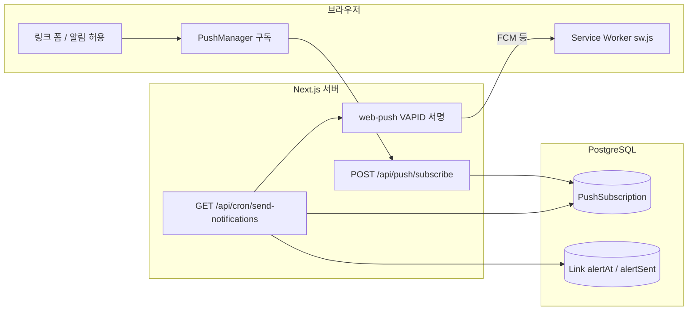

# LinkKeeper 알림(웹 푸시) 구현 정리 · 로컬 테스트 가이드

이 문서는 프로젝트에 구현된 **링크 알림 + Web Push** 흐름을 한곳에서 이해하고, **로컬에서 재현·검증**할 때 필요한 설정과 명령을 정리한 학습용 메모입니다.

---

## 1. 전체 그림



1. 사용자가 알림을 허용하면 브라우저 **Push 구독 정보**가 서버로 전달되어 DB에 저장됩니다.
2. 링크에 **알림 시각**이 저장되면 (`alertAt`), 아직 보내지 않은 건(`alertSent === false`)이 **스케줄 대상**이 됩니다.
3. **주기적으로** Cron API가 호출되면, 시각이 지난 링크에 대해 해당 사용자의 구독으로 **web-push**로 알림을 보냅니다.
4. 브라우저의 **Service Worker**가 푸시를 받아 OS 알림으로 표시합니다.

---

## 2. 데이터베이스 (Prisma)

| 모델 / 필드        | 역할                                                                        |
| ------------------ | --------------------------------------------------------------------------- |
| `PushSubscription` | 사용자별 브라우저 푸시 엔드포인트·키 (한 사용자에 여러 기기 가능)           |
| `Link.alertAt`     | 알림을 보낼 시각 (**KST 기준 ISO 문자열**, 예: `2026-03-29T15:00:00+09:00`) |
| `Link.alertSent`   | 이미 발송했는지 여부                                                        |

스키마 정의: `prisma/schema.prisma`

---

## 3. 서버 API

| 경로                           | 메서드 | 설명                                                          |
| ------------------------------ | ------ | ------------------------------------------------------------- |
| `/api/push/subscribe`          | POST   | 클라이언트 구독 JSON을 받아 `PushSubscription`에 저장·갱신    |
| `/api/cron/send-notifications` | GET    | `CRON_SECRET` Bearer 검증 후, 조건에 맞는 링크에 웹 푸시 발송 |

- Cron 라우트는 **동적·최대 실행 시간** 등이 설정되어 있을 수 있음 (`send-notifications/route.ts` 참고).
- **미들웨어**에서 `/api/cron` 경로는 Supabase 세션 갱신을 타지 않도록 우회합니다. 그렇지 않으면 Cron 호출이 세션 처리에서 실패할 수 있습니다.

```6:8:src/middleware.ts
  if (request.nextUrl.pathname.startsWith('/api/cron')) {
    return NextResponse.next()
  }
```

---

## 4. 인증: Cron 호출

- 환경 변수 **`CRON_SECRET`** 이 설정되어 있어야 합니다.
- 요청 헤더: `Authorization: Bearer <CRON_SECRET>` (문자열이 `.env`의 값과 **완전히 일치**해야 함).

로컬 스크립트 `scripts/trigger-cron-local.sh`가 `.env`에서 `CRON_SECRET`을 읽어 동일한 방식으로 호출합니다.

---

## 5. 클라이언트 · 정적 파일

| 항목                | 위치                                             |
| ------------------- | ------------------------------------------------ |
| Service Worker 등록 | `src/app/providers/ServiceWorkerRegister.tsx` 등 |
| 푸시 구독·권한      | `src/shared/utils/pushSubscription.ts`           |
| 푸시용 SW 로직      | `public/sw.js`                                   |

웹 푸시는 **VAPID** 키 쌍이 필요합니다. 공개 키는 `NEXT_PUBLIC_VAPID_PUBLIC_KEY`, 비밀 키는 `VAPID_PRIVATE_KEY`로 서버에서 서명에 사용합니다.

---

## 6. 시각(타임존)

- 링크의 `alertAt` 등은 **한국 시각을 ISO 문자열(+09:00)** 로 저장하는 방향으로 맞춰 두었습니다.
- 관련 유틸: `src/shared/lib/kstIsoString.ts`, `calculateAlertAt.ts`, `customAlertDateTime.ts` 등 (폼·API에서 일관되게 사용).

---

## 7. 배포 환경에서 “1분마다” Cron

- **Vercel Hobby**는 Cron 실행 횟수 제한이 있어, 이 프로젝트는 `vercel.json`에 **Vercel Cron을 두지 않는 설정**(`{}`)을 사용합니다.
- **Supabase**의 `pg_cron` + `pg_net`으로 배포된 사이트 URL에 `GET /api/cron/send-notifications`를 **매분** 호출하도록 SQL을 등록합니다.

템플릿: `supabase/cron/linkkeeper_notify.sql`  
배포 URL·시크릿을 `.env`에 맞춰 채운 SQL 생성: `npm run generate:supabase-cron` → `supabase/cron/linkkeeper_notify.filled.sql` (gitignore, Supabase SQL Editor에서 실행).

자세한 절차: `supabase/README.md`

---

## 8. 로컬 테스트 환경 설정

### 8.1 필수 환경 변수 (`.env`)

`.env.example`을 참고해 아래를 채웁니다.

| 변수                                                                         | 용도                                                                          |
| ---------------------------------------------------------------------------- | ----------------------------------------------------------------------------- |
| `DATABASE_URL` / `DIRECT_URL`                                                | Prisma · DB 연결                                                              |
| `NEXT_PUBLIC_SUPABASE_*`                                                     | 로그인 등 Supabase 클라이언트                                                 |
| `NEXT_PUBLIC_BASE_URL`                                                       | 로컬이면 `http://localhost:3000/` 권장 (끝 슬래시 있어도 스크립트에서 정규화) |
| `NEXT_PUBLIC_VAPID_PUBLIC_KEY` / `VAPID_PRIVATE_KEY` / `VAPID_CONTACT_EMAIL` | 웹 푸시                                                                       |
| `CRON_SECRET`                                                                | Cron API 보호 (임의의 긴 문자열)                                              |

로컬과 배포에서 **같은 DB**를 쓰면, 로컬에서 구독·링크를 만들고 같은 DB를 보는 배포 서버에서 Cron을 돌리는 식으로도 테스트할 수 있습니다 (반대로도 가능).

### 8.2 패키지 이름과 npm 스크립트

`package.json`의 `name`은 `linkkeeper`, `version`은 `0.1.0`입니다. 알림 검증에 쓰는 스크립트는 다음과 같습니다.

| 명령                             | 설명                                                                     |
| -------------------------------- | ------------------------------------------------------------------------ |
| `npm run dev`                    | Next 개발 서버 (기본 포트 3000)                                          |
| `npm run cron:local`             | **한 번** 로컬 Cron API 호출 (`scripts/trigger-cron-local.sh`)           |
| `npm run cron:local:watch`       | **약 60초마다** `cron:local`과 동일 호출 (`scripts/cron-local-watch.sh`) |
| `npm run generate:supabase-cron` | `.env` 기준으로 Supabase용 SQL 파일 생성                                 |

### 8.3 로컬에서 알림이 보이기까지 (권장 순서)

1. `.env`를 채우고 `npm run dev` 실행.
2. 브라우저(가능하면 Chrome/Edge)에서 `http://localhost:3000` 접속 → 로그인 → **알림 권한 허용** → 링크에 **곧 도래하는 알림 시각** 저장.
3. 알림 시각이 **지난 뒤**, 다른 터미널에서 `npm run cron:local` **또는** 개발 중에는 `npm run cron:local:watch` 로 주기 호출.
4. OS·브라우저에서 해당 사이트 알림이 차단되지 않았는지 확인.

**주의:** Supabase SQL로 등록한 `pg_cron`은 **클라우드에서** HTTP 요청을 보냅니다. `http://localhost:3000`은 그 요청의 대상이 될 수 없습니다. 로컬만 테스트할 때는 **반드시** `cron:local` / `cron:local:watch`를 사용합니다.

---

## 9. 구현 로직 요약 (한 줄씩)

1. **구독 저장:** 클라이언트가 `PushManager.subscribe` 결과를 서버에 POST → `PushSubscription` upsert.
2. **알림 시각:** 폼에서 선택한 날짜·시간을 KST ISO 문자열로 DB에 저장.
3. **발송 조건:** Cron 핸들러가 DB에서 `alertAt <= now` (및 미발송 등) 조건으로 링크를 조회.
4. **전송:** `web-push`로 각 사용자의 구독 엔드포인트에 페이로드 전송 → 발송 후 `alertSent` 등 갱신.
5. **표시:** `sw.js`의 `push` 이벤트에서 알림 UI 표시.

---

## 10. 관련 파일 빠른 목록

- API: `src/app/api/push/subscribe/route.ts`, `src/app/api/cron/send-notifications/route.ts`
- 푸시 서버 유틸: `src/shared/lib/webPushServer.ts`
- 미들웨어: `src/middleware.ts`
- SW: `public/sw.js`
- 로컬 Cron: `scripts/trigger-cron-local.sh`, `scripts/cron-local-watch.sh`
- Supabase Cron SQL: `supabase/cron/linkkeeper_notify.sql`, `supabase/README.md`

---

이 문서는 구현이 바뀔 수 있으므로, 동작이 어긋나면 위 경로의 실제 코드와 `package.json`의 `scripts`를 기준으로 확인하세요.
